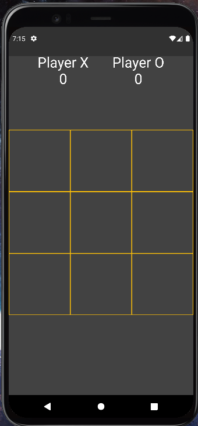
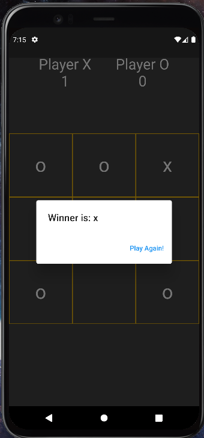
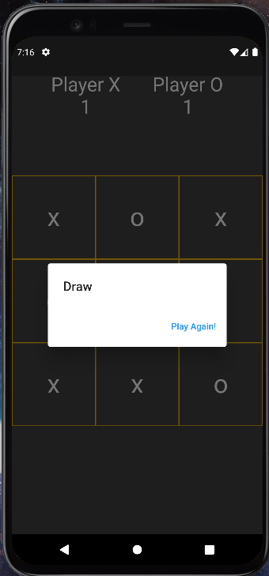

# tic_tac_toe

## Getting Started

This project is the second flutter project that I have created.

A few resources to get you started if this is your first Flutter project:

- [Lab: Write your first Flutter app](https://docs.flutter.dev/get-started/codelab)
- [Cookbook: Useful Flutter samples](https://docs.flutter.dev/cookbook)

For help getting started with Flutter development, view the
[online documentation](https://docs.flutter.dev/), which offers tutorials,
samples, guidance on mobile development, and a full API reference.

## Intro to the project
This is the simple tic tac toe game that we used to play in our childhood. The rules are pretty straightforward. The one player (among the two) who makes the straight line of three same symbol wins. 

Some screenshots of the application are as follows.

  
 
 

